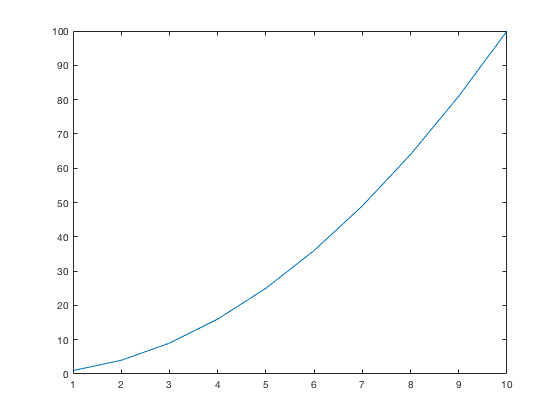

# publishreadme.m: Publish Matlab README file to markdown and html


Author: Kelly Kearney


This repository includes the code for the `publishreadme.m` Matlab function, along with all dependent functions required to run it.


This function is designed to publish a README.m documentation and examples script to both HTML and GitHub-flavored markdown, making it easier to use a single file for both GitHub and MatlabCentral File Exchange documentation.


## Contents


- Getting started        
- Syntax        
- Examples        
- Contributions

## Getting started


**Prerequisites**


This function requires Matlab R14 or later.


**Downloading and installation**


This code can be downloaded from [Github](https://github.com/kakearney/publishreadme-pkg/)


**Matlab Search Path**


The following folders need to be added to your Matlab Search path (via `addpath`, `pathtool`, etc.):


```matlab
publishreadme-pkg/publishreadme
```


## Syntax


```
publishreadme(folder, xmlflag)
```


Input variables:


- `folder`: path to folder where README.m file is located
- `xmlflag`: logical scalar, indicates whether to create XML file (true) or not (false)


## Examples


This file is itself an example of how this function can be used.  The README.m file was used to write documentation for this code, then converted to both HTML and GitHub-flavored markdown via the `publishreadme` function.


Just for demonstration purposes, here is an example with some syntax-highlighted code, along with the screen printout and plot resulting from it:


```matlab
x = 1:10;
y = x.^2

plot(x,y);
```


```

y =

1     4     9    16    25    36    49    64    81   100


```





## Contributions


Community contributions to this package are welcome!


To report bugs, please submit [an issue](https://github.com/kakearney/example-pkg/issues) on GitHub and include:


- your operating system
- your version of Matlab and all relevant toolboxes (type `ver` at the Matlab command line to get this info)
- code/data to reproduce the error or buggy behavior, and the full text of any error messages received

Please also feel free to submit enhancement requests, or to send pull requests (via GitHub) for bug fixes or new features.


I do monitor the MatlabCentral FileExchange entry for any issues raised in the comments, but would prefer to track issues on GitHub.


<sub>[Published with MATLAB R2016b]("http://www.mathworks.com/products/matlab/")</sub>
